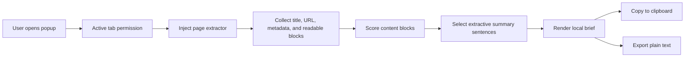

# Webpage Brief Extension

Webpage Brief is a Manifest V3 browser extension that turns the current tab into a short, local, extractive summary. It reads visible page text in the browser, scores likely content blocks, selects high-value sentences, and lets you copy or export the result as plain text.

The extension is designed for people who review lots of web pages and need a quick brief before deciding whether to read, save, share, or cite the full source.

## Who it is for

- Researchers and students triaging articles, documentation, and references.
- Product, engineering, and support teams scanning changelogs, docs, and issue pages.
- Operators and analysts who need a fast page brief without sending page content to a hosted summarization service.
- Privacy-conscious users who prefer deterministic local extraction over remote AI processing.

## Real-world use cases

- Summarize a long article before deciding whether it belongs in a reading queue.
- Extract the main points from release notes, help docs, or technical blog posts.
- Create a quick meeting-prep note from a product page or support article.
- Copy a short source-linked brief into notes, tickets, or research logs.
- Export a plain-text summary for offline review.

## How it works



The extension does not generate new claims. It extracts and ranks sentences that already appear on the page. The summarizer favors visible article-like content, title overlap, useful sentence length, and early page position while penalizing common boilerplate such as cookie notices, menus, login prompts, and social-sharing text.

## Permissions and privacy

Webpage Brief uses only these Chrome extension permissions:

- `activeTab`: temporarily access the tab where you click the extension.
- `scripting`: run the local page extractor in that active tab.

Privacy posture:

- Page content is processed locally in the browser.
- There is no backend service.
- There are no API keys or required environment variables.
- The extension does not declare host-wide permissions.
- The extension does not send page content, summaries, or URLs to a remote service.

Clipboard access is used only when you click the Copy button. Plain-text export creates a local `.txt` download from the generated brief.

## Setup

Prerequisites:

- Node.js 24.x
- npm
- A Chromium-based browser that supports Manifest V3 extensions

Install dependencies:

```bash
npm ci
```

Build the extension:

```bash
npm run build
```

Load the unpacked extension:

1. Open `chrome://extensions`.
2. Enable Developer mode.
3. Choose Load unpacked.
4. Select the generated `dist` folder.
5. Open a webpage, click Webpage Brief, choose a summary length, and click Summarize page.

## Commands

```bash
npm run lint       # Run ESLint
npm test           # Run Vitest tests
npm run build      # Type-check and build the extension into dist/
npm run audit      # Fail on moderate-or-higher npm advisories
npm run outdated   # Report stale npm dependencies
```

## Codebase structure

```text
.
|-- .github/
|   |-- dependabot.yml        # Weekly npm and GitHub Actions update checks
|   `-- workflows/ci.yml      # CI lint, test, build, audit, and freshness checks
|-- public/
|   |-- manifest.json         # Manifest V3 extension metadata and permissions
|   `-- icons/                # Extension icons
|-- src/
|   |-- domain/
|   |   |-- briefFormatting.ts
|   |   |-- contentScoring.ts
|   |   `-- summarizer.ts
|   `-- extension/
|       |-- pageExtractor.ts  # In-page readable text extraction
|       |-- popup.css
|       `-- popup.ts          # Popup UI and browser extension wiring
|-- tests/                    # Domain-level Vitest coverage
|-- popup.html                # Extension popup shell
|-- vite.config.ts            # Extension build configuration
`-- .env.example              # Safe placeholder for future local config
```

## Dependency maintenance

Dependency hygiene is handled in three places:

- `npm run audit` checks for moderate-or-higher vulnerabilities.
- `npm run outdated` reports packages that are no longer current.
- Dependabot opens weekly update pull requests for npm packages and GitHub Actions.

CI runs the same checks on pushes to `main` and pull requests, alongside linting, tests, and the production build.
