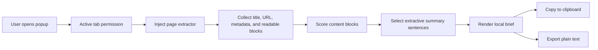

# Architecture

Webpage Brief is a Manifest V3 browser extension. When the user opens the popup, it
injects a page extractor into the active tab, collects readable text, ranks it, and
renders a short extractive brief locally. There is no backend.

Diagram source: [architecture.mmd](architecture.mmd).

## How the brief is built

The extension does not generate new claims. It extracts and ranks sentences that already
appear on the page. The summarizer favors visible article-like content, title overlap,
useful sentence length, and early page position while penalizing common boilerplate such
as cookie notices, menus, login prompts, and social-sharing text.

## Components

| Path | Role |
| --- | --- |
| `public/manifest.json` | Manifest V3 extension metadata and permissions |
| `public/icons/` | Extension icons |
| `popup.html` | Extension popup shell |
| `src/extension/popup.ts` | Popup UI and browser extension wiring |
| `src/extension/pageExtractor.ts` | In-page readable text extraction |
| `src/extension/popup.css` | Popup styles |
| `src/domain/contentScoring.ts` | Content block scoring |
| `src/domain/summarizer.ts` | Extractive sentence selection |
| `src/domain/briefFormatting.ts` | Brief text formatting for copy and export |
| `vite.config.ts` | Extension build configuration |
| `.env.example` | Safe placeholder for future local config |
| `.github/dependabot.yml` | Weekly npm and GitHub Actions update checks |
| `.github/workflows/ci.yml` | CI lint, test, build, audit, and freshness checks |

## Permissions and privacy

Webpage Brief uses only these Chrome extension permissions:

- `activeTab`: temporarily access the tab where you click the extension.
- `scripting`: run the local page extractor in that active tab.

Privacy posture:

- Page content is processed locally in the browser.
- There is no backend service.
- There are no API keys or required environment variables.
- The extension does not declare host-wide permissions.
- The extension does not send page content, summaries, or URLs to a remote service.

Clipboard access is used only when you click the Copy button. Plain-text export creates
a local `.txt` download from the generated brief.
